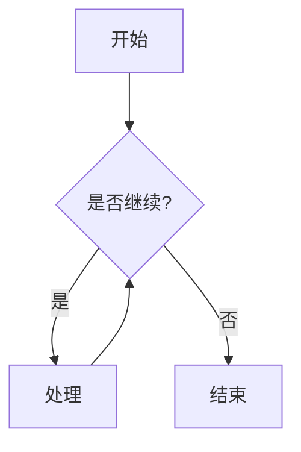
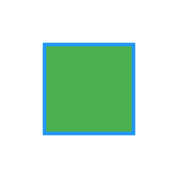

这是一个用于测试Quartz各项功能的示例文档。我们将展示各种Markdown语法和特殊功能。

  

## 基础Markdown语法

  

### 列表测试

  

无序列表：

- 苹果

- 香蕉

- 橙子

  

有序列表：

1. 第一项

2. 第二项

3. 第三项

  

### 文本格式

  

- **粗体文本**

- *斜体文本*

- ~~删除线文本~~

- `行内代码`

  

### 引用

  

> 这是一段引用文本

> 可以有多行

> 用于突出显示重要内容

  

### 代码块

  

```python

def hello_world():

print("Hello, Quartz!")

return True

  

# 调用函数

hello_world()

```

  

### 表格


| 功能 | 支持情况 | 备注 | 
|------|----------|------|
| 基础Markdown | ✅ | 完全支持 |
| Wiki链接 | ✅ | [[wikilinks]] |
| 数学公式 | ✅ | 支持LaTeX |

  

## Quartz特殊功能

  

### Callouts

  

> [!note] 提示

> 这是一个提示性的Callout

  

> [!warning] 警告

> 这是一个警告性的Callout

  

### Mermaid图表

  



  

### LaTeX数学公式

  

行内公式：$E = mc^2$

  

独立公式：

$$

\frac{d}{dx}\left( \int_{0}^{x} f(u)\,du\right)=f(x)

$$

  

### 图片链接

  



  

这是一个使用SVG制作的简单动画，展示了一个旋转的彩色方块。

  

## 交叉引用

  

- 查看 [[index|首页]]

- 了解更多 [Wiki链接](https://quartz.jzhao.xyz/features/wikilinks)

  

---

  

这个测试文档展示了Quartz支持的主要功能。你可以基于这个模板进行进一步的测试和定制。